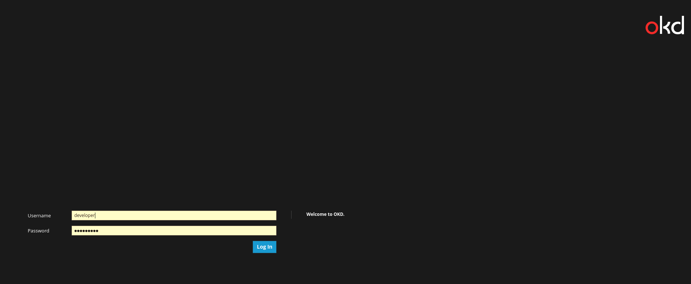

To access the Openshift console:

Click on the _Dashboard_ tab in the workshop dashboard. You will be presented with the OpenShift login screen.

For the credentials, enter:

* **Username:** ``admin``{{copy}}
* **Password:** ``admin``{{copy}}

Once you have logged in, you should be shown the list of projects you have access to. A project called ``opendatahub`` has already been created for you to use in this workshop.

In this project you should be able to see a working OpenDataHub Deployment.
